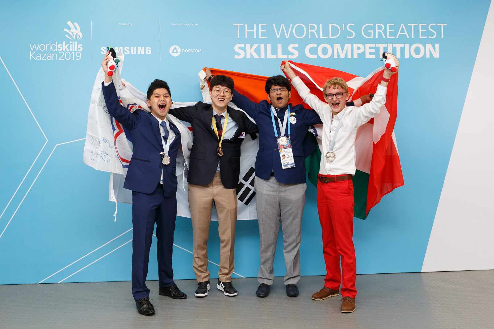

## 소개

프론트엔드 개발자 이운호입니다.

코드 리뷰를 통해, 이해하기 쉽고 효율적인 코드를 작성하는 것을 좋아하며,
이미 만들어진 코드를 더 좋은 코드로 리팩토링하는 것을 즐깁니다.

프로젝트를 진행할 때, 기존에 진행했던 방식을 선택하기 보다는 새로운 라이브러리와 프레임워크를 사용하면서 도전하는 것을 추구합니다.
효율적인 개발을 위해서는 커뮤니케이션이 중요하다고 생각하며, 이를 통해 업무 효율을 극대화하고자 합니다.

최근에는 재사용성 높은 컴포넌트 설계에 관심 있으며, 그 외에도 좋은 코드를 작성하는 방법에 대해 고민하고 있습니다.

## 수상 경력

- 2019 러시아 카잔 국제기능올림픽 - Web Technology 1위
- 2018 아부다비 Asia Skills - Web Technology 3위
- 2018 전국기능경기대회 - 웹 디자인 및 개발 1위
- 2018 경기도 기능경기대회 - 웹 디자인 및 개발 1위
- 2017 SK 스마틴 앱 챌린지 - 최우수상
- 2017 경기도 기능경기대회 - 웹 디자인 및 개발 4위
- 2016 S/W 실전 창의 인재 양성 해커톤 대상

## 외부 활동

- 2021 SK 스마틴 앱 챌린지 - 멘토 활동
- 2021 강원도 기능경기대회 - 웹 디자인 및 개발 심사위원
- 2019 러시아 카잔 국제기능 올림픽 - 국가대표
- 2018 아부다비 아시아 스킬스 - 국가대표
- 2018 SK 스마틴 앱 챌린지 - 일본 연수
- 2017 SK 스마틴 앱 챌린지 - 부트캠프
- 2017 티맥스 나누미 5기 - 멘토 활동
- 2016 티맥스 나누미 4기 - 멘티