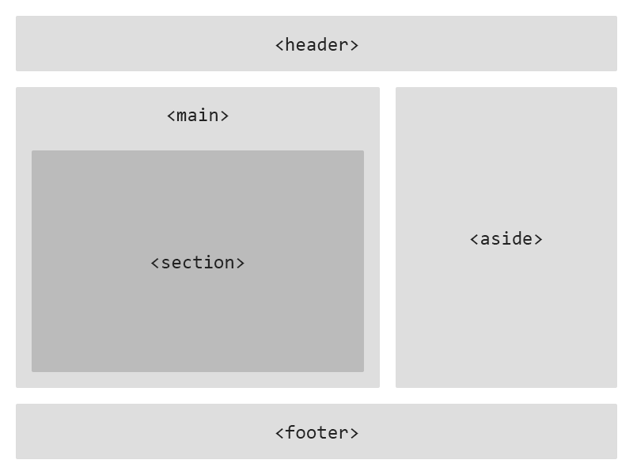
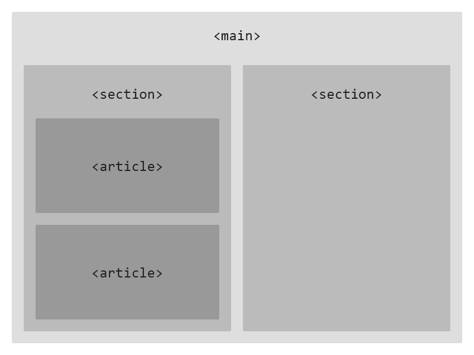

## 시맨틱 태그란?
HTML5부터 추가된 시맨틱 태그는 개발자와 브라우저에게 의미를 전달하는 태그라고 보면 된다.

`<div>`와 `<span>` 태그를 non-semantic 태그라고 할 수 있고,
`<section>`, `<article>`, `<header>`, `<footer>` 등을 semantic 태그라고 보면 된다.

무슨 차이가 있는지 모르겠다면 간단하게 생각하면 되는데,
일반적으로 non-semantic 태그인 `<div>`와 `<span>`을 사용한 경우 어떤 내용을 담고 있을지 유추하기 어렵지만,
`<header>` 혹은 `<footer>`와 같은 시맨틱 태그를 사용한 경우, 어떤 내용을 담고있을지 알 수가 있다.

## 시맨틱 태그를 왜 사용해야 하는 것일까?

사실 빠른 코드 작성을 목적으로 한다면, non-semantic 태그를 사용하는게 좋은 방법일 수도 있다.

하지만 단발성의 코드가 아닌 유지보수를 해야하고, 협업을 해야하는 프로젝트라면 말이 달라진다.

아래 작성된 코드를 통해, 어떤 차이가 있는지 알아보자.

```html
<div>
    <div>
        <div>
            
        </div>
        <div>
            <div>Title</div>
            <div>Lorem Ipsum is simply dummy text of the printing and typesetting industry.</div>
            <div>2021/05/04</div>
        </div>
    </div>
</div>
```

위 코드는 이해를 돕기 위해 `<div>` 태그만을 사용해서 작성한 HTML이다.

해당 코드를 보았을 때, 바로 이해할 수 있다고 말하는 사람들도 있을 것이다.
하지만 코드의 길이가 지금보다 10배 20배 이상 길어진다면, 대부분의 사람들이 바로 이해하기 어려울 것이다.


```html
<main>
    <section>
        <article>
            <figure>
                
            </figure>
            <div>
                <h2>Title</h2>
                <p>Lorem Ipsum is simply dummy text of the printing and typesetting industry.</p>
                <time>2021/05/04</time>
            </div>
        </article>
    <section>
</main>
```

반면 시맨틱 태그를 사용한 코드를 보면, `<div>` 태그만을 사용한 코드에 비해서 쉽게 이해할 수 있다고 생각한다.

뿐만 아니라, 코드를 직접 수정해보면 시맨틱 태그를 사용하는 것이 훨씬 낫다고 생각하게 된다.

수없이 많은 `<div>`로 구성된 코드에서 수정하는 것과 `<section>`, `<article>`와 같은 시맨틱 태그로 구성된 코드에서
수정하는 것 어떤 것이 더 편할지 생각해보면 직접 수정해보지 않아도 알 수 있다.

# 시맨틱 태그와 SEO의 관계

웹 사이트는 특별한 경우를 제외하면 Naver와 Google같은 검색 플랫폼에서의 노출이 매우 중요하다.

위와 같은 검색 플랫폼은 매일 검색 엔진 봇을 이용하여 웹 사이트의 정보를 수집하고, 해당 정보를 우리에게 제공한다.
우리는 웹 사이트를 이미지와 비디오등 그래픽 요소와 텍스트를 함께 볼 수 있지만, 검색 엔진 봇은 우리와 달리 구조를 이해하지 못 한다.
하지만 시맨틱 태그를 사용할 경우, 검색 엔진 봇은 홈페이지의 구조를 보다 자세하게 파악할 수 있게 되어 SEO에 좋은 영향을 준다고 보면 된다.

예를 들어, 아래와 같은 코드가 있다고 생각해보자.

```html
<!-- 1번 -->
<div>
    <div>뉴스의 제목입니다.</div>
    <div>뉴스의 내용입니다.</div>
</div>

<!-- 2번 -->
<article>
    <h2>뉴스의 제목입니다.</h2>
    <p>뉴스의 내용입니다.</p>
</article>
```

다음 코드에 추가적으로 CSS를 적용할 경우, 브라우저에서 1번과 2번은 동일하게 보이며, 우리는 차이점을 느끼지 못 한다. 하지만 검색 엔진 봇은
 1번과 2번을 다르게 분류할 수도 있다. 이유는 앞서 설명한 semantic 태그에 있다.

1번은 `<div>`로 구성되어 있기에, 따로 인지하지 않을테지만, 2번의 경우 `<article>`은 뉴스 기사, 블로그 글등을 나타내기에 뉴스 기사 혹은 글
로 인지하고, `<h2>`는 해당 글의 제목으로 인식할 것이다.

SEO 개선을 원하는 사람이라면, semantic 태그의 사용을 고려해보는 것도 좋은 선택일 것이다. 
다만 너무 많은 semantic 태그의 사용은 오히려 SEO에 악영향을 미칠 수 있다는 걸 참고하자.

## 시맨틱 태그의 구조를 이미지로 알아보자


필수적으로 아래와 같이 구성을 해야한다는 건 아니지만, 보편적으로 저런 구조라고 알아두시면 됩니다.




## 자주 사용하는 시맨틱 태그를 알아보자

- `<header>`: \
    웹 페이지의 최상단 머릿글이라고 보면 된다. \
    일반적으로 로고, 네비게이션와 같은 요소를 넣는다.
- `<main>`: \
    웹 페이지의 몸통이라고 보면 된다. \
    일반적으로 `<header>`와 `<footer>`를 제외한 대부분의 요소가 들어간다.
- `<footer>`: \
    웹 페이지의 하단 바닥글이다. \
    copyright &copy; 과 소셜 링크 등이 들어간다.
- `<section>`: \
    섹션을 정의하는 태그이다. \
    `<h1> ~ <h6>`와 같은 제목이 들어가야 한다.
- `<article>`: \
    문서, 페이지에 비종속적이며, 독립적으로 구성하는 요소를 만들 때 사용합니다. \
    예시:
    1. 포럼 게시물
    2. 블로그 글
    3. 뉴스 기사