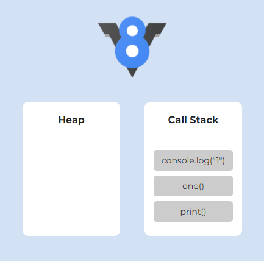
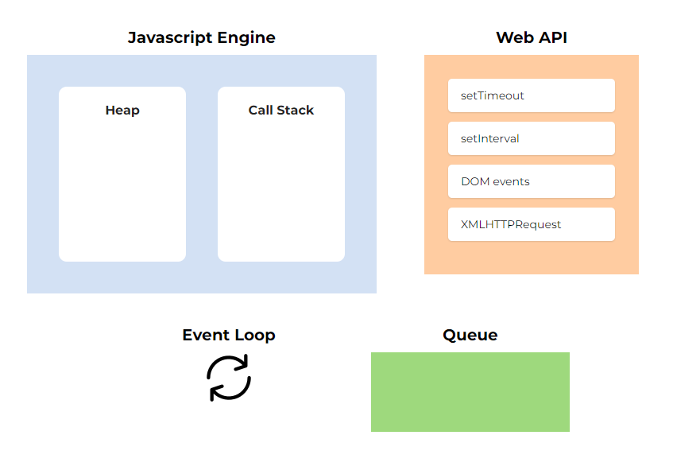

## 들어가며

다들 사용해본 경험이 있겠지만 자바스크립트를 통해 웹 페이지의 DOM과 이벤트 핸들링등 다양한 작업들을 할 수 있다.
뿐만 아니라 취향에 따라 비동기/동기적으로 코드를 작성할 수 있다.
근데 자바스크립트는 싱글 스레드 언어인데 어떻게 여러 요청을 받을 수 있는 걸까?
자바스크립트가 싱글 스레드임에도 불구하고 이렇게 동작하는 원리에 대해 알아보려고 한다.

## 자바스크립트의 싱글 스레드

자바스크립트는 메인 스레드인 이벤트 루프 하나로 구성되어 싱글 스레드로 동작한다.
싱글 스레드는 한 번에 하나의 작업만 수행할 수 있다. 
즉 시간이 많이 소요 되는 함수가 미리 호출된 경우, 다른 코드의 실행이 늦어진다는 이야기가 된다.

하지만 우리는 Ajax 요청하고 응답을 기다리면서 다른 함수의 호출이 가능하다.
그 외에도 setTimeout, requestAnimationFrame 등의 함수를 통해서 동시에 여러 가지의 작업을 할 수 있다.
이렇게 여러 가지의 작업을 할 수 있는 이유는 이벤트 루프 덕분이다.

## 자바스크립트의 엔진 구성 요소

자바스크립트의 엔진은 다음과 같이 메모리 힙과 콜스택으로 구성된다.


- 메모리 힙(Memory Heap): 참조 타입(객체 등) 데이터가 저장되는 공간으로 메모리 할당이 일어난다.
- 콜스택(Call Stack): 수행해야 할 함수들을 저장하는 스택 자료구조다.

자바스크립트는 싱글 스레드로 동작하기 때문에 한 개의 콜스택을 가지고 있는데,
이러한 콜스택이 어떻게 수행해야 할 함수들을 다루는지에 대해 알아보자.

예를 들어, 다음과 같은 코드가 있다고 가정해보자.

```javascript
function one() {
    console.log("1");
}

function print() {
    one();
}

print();
```

먼저 `print` 함수를 호출할 경우, 아래 이미지와 같이 콜스택에 추가 되며 함수가 실행 완료된 이후에 제거되는 LIFO(Last In First Out) 방식으로 실행된다.



실제 실행 순서는 다음과 같다.

1. print 함수 호출 (콜스택 추가)
2. one 함수 호출 (콜스택 추가)
3. `console.log("1")` 호출 (콜스택 추가)
4. `console.log("1")` (콜스택 제거)
5. one 함수 (콜스택 제거)
6. print 함수 (콜스택 제거)

## 자바스크립트의 런타임

앞서 이야기했던 것처럼 자바스크립트의 엔진은 싱글 스레드라고 볼 수 있다.
하지만 자바스크립트는 웹 브라우저나 Node.js와 같이 멀티 스레드 환경에서 실행되는데, 이러한 런타임 환경이 비동기 요청을 담당하게 된다.

런타임 환경에서는 다음과 같은 리스트들을 제공한다.



자바스크립트의 엔진과 외부의 런타임 환경들이 합쳐진 모습으로 이벤트 루프, 웹 API, Callback Queue가 존재한다.
각각의 요소들은 다음과 같은 역할을 가진다.

- Web API: 브라우저에서 제공하는 API로 DOM 이벤트, setTimeout등을 비롯한 비동기 작업을 수행할 수 있도록 지원한다.

- Queue: 비동기 작업으로 처리되어야 할 태스크들을 저장한다. 
이벤트 루프가 정해준 우선 순위에 맞게 처리된다.

- 이벤트 루프(Event Loop): 콜스택과 Callback Queue의 상태를 확인하며, 콜스택이 비어있으면 Callback Queue의 태스크를 넘겨주는 역할을 한다.

각각의 요소들이 어떻게 작동하는지에 대해서 알아보자.

### 1. 함수 호출

앞서 설명했던 것처럼 함수는 호출되면 콜스택에 추가되며, LIFO 방식으로 마지막에 추가된 함수부터 실행한 이후에 콜스택에서 제거된다.


### 2. Web API

`respond` 함수를 보면 `setTimeout` 함수를 반환하는 걸 알 수 있다. 
`setTimeout` 함수에 전달한 콜백 함수는 Web API에 추가되며, 다른 작업을 할 수 있도록 비동기로 처리된다.


### 3. Queue 이동

`setTimeout` 콜백 함수는 조건을 만족할 경우, 바로 콜스택으로 이동하지 않고 Queue로 이동하게 된다.


### 4. 이벤트 루프

이렇게 Queue로 이동 된 콜백 함수는 이벤트 루프에 의해서 처리된다.
먼저 이벤트 루프가 콜스택이 비어있는지를 확인 한 후, 콜스택이 비어있을 경우에만 해당 콜백 함수를 추가한다.

예제에서는 `setTimeout`를 제외한 다른 비동기 함수의 호출이 없어서, 
바로 콜스택으로 이동하는데 동시에 호출되더라도 항상 정해진 우선 순위에 따라 처리된다.


### 5. 콜백함수 호출

1번에서 설명했던 내용과 동일하게 콜스택에 추가된 콜백함수는 실행되며, 콜스택에서 제거된다.


---
참고: [https://dev.to/lydiahallie/javascript-visualized-event-loop-3dif](https://dev.to/lydiahallie/javascript-visualized-event-loop-3dif)