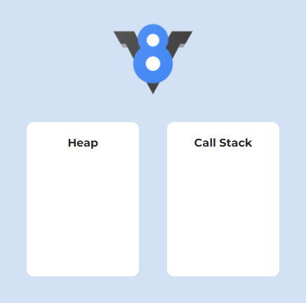

## 들어가며

다들 사용해본 경험이 있겠지만 자바스크립트를 통해 웹 페이지의 DOM과 이벤트 핸들링등 다양한 작업들을 할 수 있다.
뿐만 아니라 취향에 따라 비동기/동기적으로 코드를 작성할 수 있다.
근데 자바스크립트는 싱글 스레드 언어인데 어떻게 여러 요청을 받을 수 있는 걸까?
자바스크립트가 싱글 스레드임에도 불구하고 이렇게 동작하는 원리에 대해 알아보려고 한다.

## 자바스크립트의 싱글 스레드

자바스크립트는 메인 스레드인 이벤트 루프 하나로 구성되어 싱글 스레드로 동작한다.
싱글 스레드는 한 번에 하나의 작업만 수행할 수 있다. 
즉 시간이 많이 소요 되는 함수가 미리 호출된 경우, 다른 코드의 실행이 늦어진다는 이야기가 된다.

하지만 우리는 Ajax 요청하고 응답을 기다리면서 다른 함수의 호출이 가능하다.
그 외에도 setTimeout, requestAnimationFrame 등의 함수를 통해서 동시에 여러 가지의 작업을 할 수 있다.
이렇게 여러 가지의 작업을 할 수 있는 이유는 이벤트 루프 덕분이다.

## 자바스크립트의 엔진 구성 요소

자바스크립트의 엔진은 다음과 같이 메모리 힙과 콜스택으로 구성된다.

- 메모리 힙(Memory Heap): 참조 타입(객체 등) 데이터가 저장되는 공간으로 메모리 할당이 일어난다.
- 콜스택(Call Stack): 수행해야 할 함수들을 저장하는 스택 자료구조다.