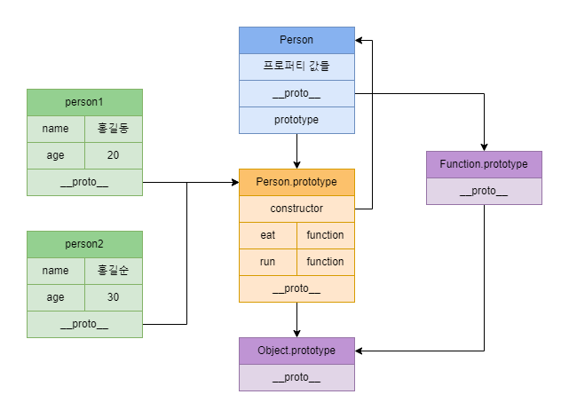

## 들어가며

자바스크립트에서는 프로토타입이란 걸 사용하는데, 도대체 왜 프로토타입을 사용하는지 알아보자.

프로토타입은 특정 객체의 부모 역할을 하며, 하위 객체에게 프로퍼티와 메소드를 사용할 수 있도록 상속한다고 볼 수 있다.
즉 우리는 프로토타입을 통해 객체의 인스턴스가 메소드를 사용할 수 있도록 쉽게 정의할 수 있다.

## 프로토타입이 필요한 이유

예를 들어, 이름과 나이를 받아서 객체를 생성하는 함수가 있다고 가정해보자.
함수는 다음과 같은 구조로 설계된다.

```javascript
function Person(name, age) {
  this.name = name;
  this.age = age;
}
```

근데 여기서 뛴다/먹는다와 같은 메소드가 필요하면 어떻게 추가해야 할까? 
우리는 `this` 키워드를 사용해서, 메소드를 정의할 수 있다.

```javascript
function Person(name, age) {
  this.name = name;
  this.age = age;
  this.run = function() {
    return `${this.name}은 뛴다`;
  };
  this.eat = function() {
    return `${this.name}은 음식을 먹는다`;
  };
}
```

이렇게 정의 된 메소드는 객체를 생성한 이후에 사용할 수 있다.

아래 예제를 살펴보자.

```javascript
const person1 = new Person("홍길동", 20);
const person2 = new Person("홍길순", 30);

person1.run(); // 홍길동은 뛴다
person1.eat(); // 홍길동은 음식을 먹는다'

person2.run(); // 홍길순은 뛴다
person2.eat(); // 홍길순은 음식을 먹는다'

person1.run === person2.run // false
person1.eat === person2.eat // false
```

메소드는 정상적으로 작동하고, 크게 문제 될 건 없어 보이는데 여기서 문제가 발생한다.
바로 person1 객체와 person2 객체의 메소드가 서로 다르다는 것이다.
객체를 생성할 때마다 메소드를 객체의 일부로 생성하는데, 이는 자원 낭비로 연결된다.
이러한 낭비를 방지하기 위해서는 프로토타입을 통한 상속이 필요하다.

다음은 앞서 작성한 코드를 프로토타입으로 변경한 코드다.

```javascript
function Person(name, age) {
  this.name = name;
  this.age = age;
}

Person.prototype.run = function() {
  return `${this.name}은 뛴다`;
};

Person.prototype.eat = function() {
  return `${this.name}은 음식을 먹는다`;
};

const person1 = new Person("홍길동", 20);
const person2 = new Person("홍길순", 30);

person1.run === person2.run // true
person1.eat === person2.eat // true
```

person1 객체와 person2 객체의 run과 eat 메소드가 동일한 것을 볼 수 있는데,
객체를 만들 때마다 생성하지 않고, 부모 객체의 메소드를 사용한다고 보면 된다.

메소드가 프로토타입에 적용되므로, 이전과는 다르게 메모리에 한 번만 저장되지만 Person 객체의 모든 인스턴스는 run과 eat 메소드를 사용할 수 있게 된다.

person1 객체와 person2 객체는 직접적으로 run과 eat 메소드를 가지고 있지 않는데,
어떻게 메소드를 사용할 수 있는지에 대해서는 아래 프로토타입 체인에서 다루도록 하겠다.

## 프로토타입 체인

특정 객체의 프로퍼티 혹은 메소드에 접근하면 해당 객체에 존재하는지를 확인한다.
해당 객체에 없다면 `[[Prototype]]` 링크를 따라 부모 객체의 프로토타입을 찾는데, 이를 프로토타입 체인이라고 한다.

위에서 작성한 코드를 보면 특이하게도 `prototype`이라는 것을 사용하며, 메소드는 외부에서 정의된 걸 볼 수 있다.
이렇게 외부에서 정의한 메소드를 객체가 사용할 수 있는 이유를 알아보자.

다음은 Person 객체 인스턴스의 내부 모습이다.

```javascript
const person1 = new Person("홍길동", 20);

// person1 객체 내부
Person
  age: 20
  name: "홍길동"
  [[Prototype]]: Object
```

person1의 내부에서 eat과 run이라는 메소드는 찾을 수 없다.
이렇게 메소드를 호출했는데, 객체에 해당하는 메소드가 없는 경우에는 `[[Prototype]]` 링크를 따라가서 메소드를 찾는다.

`[[Prototype]]`을 열어보면 다음과 같다.

```javascript
Person
  age: 20
  name: "홍길동"
  [[Prototype]]: Object
    eat: f ()
    run: f ()
    constructor: f Person(name, age)
    [[Prototype]]: Object
```

우리가 찾고자 하는 메소드 eat과 run가 여기 위치한 것을 볼 수 있다.
person1이 eat이나 run 메소드를 호출하면 이렇게 프로토타입 링크를 따라가서, 해당하는 메소드를 호출한다.

여기서도 없는 다른 메소드를 호출한 경우에는 재귀 함수처럼 프로토타입 링크를 또 따라가서 메소드를 찾는다.
최상위로 올라갔는데도 못 찾을 경우, `undefined`를 반환하는데 `undefined`는 메소드가 아니기에 오류가 발생한다.

```javascript
person1.test // undefined
person1.test(); // Uncaught TypeError
```

## 프로토타입 객체

모든 객체들은 메소드와 프로퍼티를 사용하기 위해서, 프로토타입 객체를 상속 받게 된다.
프로토타입 객체는 또 다른 프로토타입 객체로부터 상속 받을 수 있는데, 다음과 같이 여러 번 상속이 가능하다.

```Javascript
- Object
  - Object
    - Animal
      - Bird
```

자바스크립트에서는 Set, Map, Date, Array와 같이 `new` 연산자로 생성할 수 있는 객체들은 모두 해당하는 객체의 프로토타입을 상속 받는다.

```javascript
(new Set).__proto__ === Set.prototype; // true
(new Map).__proto__ === Map.prototype; // true
(new Date).__proto__ === Date.prototype; // true
([]).__proto__ === Array.prototype; // true
```

원시 타입의 경우, `null`과 `undefined`를 제외한 Number, String, BigInt, Boolean, Symbol은 각각 해당하는 객체의 프로토타입을 상속 받는다.

```javascript
(1).__proto__ === Number.prototype // true
"str".__proto__ === String.prototype // true
(true).__proto__ === Boolean.prototype // true
Symbol().__proto__ === Symbol.prototype // true
(1n).__proto__ === BigInt.prototype // true

(null).__proto__ // Uncaught TypeError
(undefined).__proto__ // Uncaught TypeError
```

그리고 신기하게도 모든 객체는 `Object`의 프로토타입을 상속 받아서, `Object` 프로토타입의 메소드를 사용할 수 있다.
한 번쯤은 `toString`과 `hasOwnProperty` 메소드를 사용해본 적이 있을텐데, `Object` 프로토타입을 상속 받아서 해당 메소드들을 사용할 수 있다고 보면 된다.

```javascript
[1, 2, 3].hasOwnProperty === Object.prototype.hasOwnProperty // true
new Set([1, 2, 3]).hasOwnProperty === Object.prototype.hasOwnProperty // true
```

다만 배열의 `toString` 메소드와 같이 프로토타입이 덮어씌워지는 경우가 존재한다.

```javascript
[].toString === Object.prototype.toString // false
[].toString === Array.prototype.toString // true
```

모든 객체는 `Object` 프로토타입을 상속 받는다고 이야기했는데, 배열처럼 `Array` 프로토타입에서 `Object` 프로토타입 메소드와 동일한 이름의 메소드가 존재하는 경우, 덮어씌워진다.

앞서 설명한 프로토타입 체인이 링크된 상위 객체의 프로토타입으로 단계별로 올라가서 탐색하고 호출하는 것을 의미한다.
즉 동일한 이름의 프로토타입 메소드 혹은 프로퍼티가 존재하는 경우에는 가장 가까운 상위 객체의 메소드/프로퍼티를 사용한다고 보면 된다.

다음은 함수를 만들고 인스턴스를 생성할 때, 프로토타입의 관계가 어떻게 되는지를 이해하기 쉽도록 표현했다.



## \_\_proto__

프로토타입 객체에 대해 설명하면서, 사용한 `__proto__`에 대해서 설명하고자 한다.

`__proto__`는 현재 객체가 가지고 있는 프로퍼티는 아니며, `toString()`과 `hasOwnProperty()`와 같이 내장 객체 `Object.prototype`에 존재한다.
getter와 setter 역할을 하며, 객체 내부의 `[[Prototype]]`을 볼 수 있다.

```javascript
const obj = {};
obj.__proto__ === Object.prototype; // true

const arr = [];
arr.__proto__ === Array.prototype // true
```

위와 같이, `__proto__`는 엑세스하는 객체 내부의 프로토타입과 동일한 것을 볼 수 있다.

ES6부터는 `__proto__`를 사용하기 보다는 `Object.getPrototypeOf`를 통해, 프로토타입 정보를 가지고 오는 것을 권장한다.
그리고 `Object.setPrototypeOf`로 프로토타입을 변경할 수 있는데, 성능에 문제가 생길 수 있으므로 사용하지 않는게 좋다.