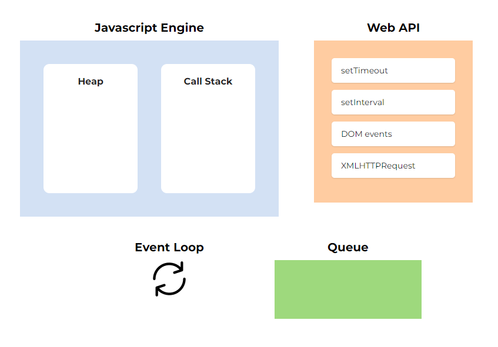

## 들어가며

자바스크립트가 싱글 스레드임에도 불구하고 여러 개의 일을 동시에 처리할 수 있는 이유는
다음과 같은 런타임 환경을 가져서이다.



여기서 큐는 Web API에서 넘겨준 비동기 함수를 저장하는데, 사실 큐에는 타입이 다른 두 개의 큐가 존재한다.
그리고 이벤트 루프는 각각의 큐들에 우선 순위를 부여하고, 우선 순위에 따라 큐들을 처리한다.

큐의 종류와 우선 순위에 대해 알아보자.

## 큐의 종류

다음과 같이 타입이 다른 두 개의 큐가 존재하는데, 각각 어떠한 기능들을 담당하는지에 대해 알아보자.


### 마이크로태스크 큐 (Microtask Queue)

Promise, async/await과 같은 비동기 호출을 넘겨 받는다.
마이크로태스크는 코드를 사용해서만 만들 수 있으며, 대표적인 예로 `Promise`를 사용해서 만든다.
`Promise`를 사용하면 `then/catch/finally` 핸들러를 사용하거나 `async/await` 사용을 할텐데, 모두 마이크로태스크에 속한다고 볼 수 있다.
추가로 `queueMicrotask` 함수를 사용하면 마이크로태스크 큐에 추가한 후 처리할 수 있다.

마이크로태스크 큐에 추가되는 함수들은 다음과 같다고 볼 수 있다.

- process.nextTick
- Promise (then/catch/finally)
- Async/Await
- Object.observe
- MutationObserver

위 gif 이미지에서 나온 것처럼 마이크로태스크는 매크로태스크에 비해서 우선적으로 처리되는데,
아래 이미지를 통해 어떤 방식으로 처리되는지 알아보자.


마이크로태스크는 렌더링 작업 및 `setTimeout` 함수와 같은 매크로태스크가 실행되기 전에 처리된다.

### 매크로태스크 큐 (Macrotask Queue)

Web API에서 비동기 함수들을 실행한 이후에 전달하는 콜백 함수들을 저장한다.

- setTimeout
- setInterval
- setImmediate
- requestAnimationFrame
- I/O
- UI rendering

## 큐의 우선 순위  

이벤트 루프는 매크로태스크 큐보다 마이크로태스크 큐를 우선 순위로 보고 처리한다고 했는데,
실제 작성된 코드를 통해 알아보자.

```javascript
setTimeout(() => {
  console.log("Macrotask");
});

Promise.resolve()
  .then(() => {
      console.log("Microtask");
  });

console.log("CallStack");
```

위와 같은 코드가 있다고 가정할 때, 우선 작성된 `setTimeout`의 콜백 함수가 먼저 호출되어야 할 것 같지만 실제로는 `Promise`의 콜백 함수가 먼저 호출되어 다음과 같이 콘솔에 출력되는 것을 볼 수 있다.

```javascript
CallStack
Microtask
Macrotask
```

그리고 매크로태스크 큐의 `setTimeout`과 `setInterval`의 경우, 누가 먼저 작성되었는지에 따라서 콜백 함수의 호출 순서가 결정된다.
하지만 `requestAnimationFrame`의 경우, 작성 순서와 관계 없이 `setTimeout`과 `setInterval` 함수보다 먼저 호출된다.

```javascript
setTimeout(() => {
  console.log("setTimeout");
});

requestAnimationFrame(() => {
  console.log("requestAnimationFrame");
});
```

위 코드를 실행해보면 `requestAnimationFrame`의 콜백 함수가 먼저 호출되는 것을 알 수 있다.
즉 정리해보면 큐의 우선 순위는 다음과 같다고 볼 수 있다.

1. 마이크로태스크 큐
2. 매크로태스크 큐 (requestAnimationFrame)
3. 매크로태스크 큐 (setTimeout, setInterval)