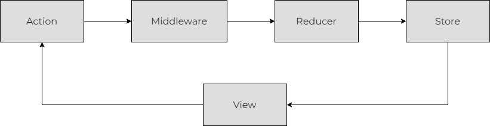

## Redux 설치

```markdown
npm install react-redux
```

## 들어가며

React로 클릭 수를 확인할 수 있는 프로그램을 만들면 상태, 상태를 변경할 수 있는 함수 그리고 UI 기능을 가지게 된다.
기능이 별로 없는 경우, 한 개의 컴포넌트에서 모두 처리할 수 있고 크게 어려움이 없다.

```javascript
function App() {
  const [counter, setCounter] = useState(0);

  const increment = () => {
    setCounter(prev => prev + 1);
  }

  return (
    <div>
      클릭 수: {counter} 
      <button onClick={increment}>증가</button>
    </div>
  )
}
```

## Redux 개념

Redux는 아래 그림과 같은 구조로 상태값을 관리한다.



예를 들어, 사용자가 화면에서 로그인을 한다고 가정했을 때, Redux가 어떻게 작동하는지 알아보자.

1. 사용자가 로그인 시, 서버에서 확인 후 문제가 없다면 유저 정보를 가지고 온다.
2. 전역에서 사용할 수 있도록 정보를 저장하는 `Action` 함수가 실행 된다.
3. `Middleware`가 실행되며, 에러가 발생할 경우 서버로 전송하거나 `Action`을 무효 처리한다.
4. `Reducer`는 `Action`을 처리하고, 새로운 상태값을 만든다.
5. 새롭게 만들어진 상태값이 `Store`에 반영 되고, 변경된 값은 `View`에 반영 된다.
6. 화면에서 로그인 된 상태로 나오며, 모든 컴포넌트는 유저 정보에 접근할 수 있게 된다.

여기서 `View`는 사용자에게 보여지는 화면을 말하며, 컴포넌트라고 보면 된다.
이제 앞서 나온 Redux의 네 가지 요소들이 어떤 역할을 하고, 어떻게 사용하는지 자세하게 알아보자.

## Action

`store.dispatch()` 호출을 통해, 리듀서를 실행할 수 있다.

## Middleware

## Reducer

Reducer는 현재 상태값과 Action 객체 이렇게 두 개의 인자를 가진다. Redux는 처음에 시작할 때, 아무런 상태도 가지고 있지 않기때문에 우리는 초기 상태를 지정해줘야 한다.

```javascript
function counterReducer(state = initialState, action) {

}
```

Action 객체는 고유한 `type` 필드를 가져야 한다. 
type을 통해 어떠한 작업을 할지 결정되며, 새로운 상태값을 만들거나 기존 상태값을 반환해야 한다.

```javascript
function counterReducer(state = initialState, action) {
    switch (action.type) {
        case 'counter/increment':
            return { ...state, value: state.value + 1};
        case 'counter/decrement':
            return { ...state, value: state.value - 1};
        default:
            return state;
    }
}
```

여기서 주의할 점은 객체의 불변성을 유지하기 위해, 기존 객체를 복사해서 수정해야 한다.

## Store

## Connect?

## 그 외 메소드
`store.getState()`을 통해 store에서 최신 상태를 가져올 수 있다.

`store.subscribe()`는 callback 함수를 인자로 받으며, store가 업데이트 될 때마다 실행된다.

```javascript
export default connect(mapStateToProps, mapDispatchProps)(componentName);
```