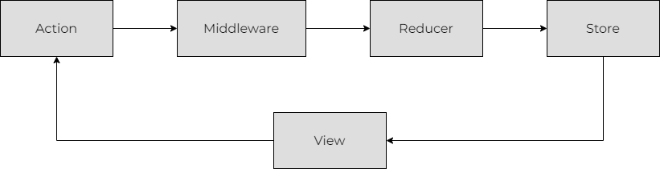

## 들어가며

React를 사용한 프로젝트에서는 상태 관리에 대한 고민이 필요하다.
대부분 효율적인 상태 관리를 위해서 다양한 라이브러리를 사용하는데, 그 중에서 React 프로젝트에서 Redux의 사용 비중이 50% 정도를 차지한다.

물론 규모가 작은 프로젝트에서는 상태 관리에 대한 고민이 필요 없을 수 있고, 
단순히 전역 상태 공유가 필요한 경우에는 `Context API`만으로도 구현이 가능하다.

그럼 왜 많은 프로젝트에서 Redux를 사용하는지, 그 이유를 알아보자.

- 상태 관리 코드 분리
- 서버 렌더링 시, 간편한 데이터 전달
- 로컬 스토리지를 사용한 데이터 저장 및 불러오기
- 전역 상태 공유
- 페이지 전환 시에도 유지되는 데이터
- 재사용 가능한 코드

이외에도 Redux를 사용하면 좋은 점들이 있으며, `redux-thunk`, `redux-saga`, `redux-devtools`등의 다른 라이브러리의 추가 사용을 통해, 상태 관리를 편리하게 할 수 있다.

## Redux 설치

다음 명령어를 사용해서, 설치할 수 있으며 React 프로젝트 뿐만 아니라 Javascript로 작성한 모든 프로젝트에서 상태 관리를 위해 사용할 수 있다.

```markdown
npm install react-redux
```

## 규모에 따른 상태 관리

프로젝트의 규모에 따라 상태 관리의 난이도는 크게 달라지게 되는데, 먼저 작은 컴포넌트에서는 어떻게 상태 관리를 하는지 간단하게 알아보자.
다음은 클릭 수를 확인할 수 있는 컴포넌트다.

```javascript
/* 한 개의 컴포넌트에서 모두 처리 */
function Counter() {
  /* 상태, 상태 변경 함수 */
  const [counter, setCounter] = useState(0);

  /* 상태 변경 실행 함수 */
  const increment = () => {
    setCounter(prev => prev + 1);
  }

  /* UI */
  return (
    <div>
      클릭 수: {counter} 
      <button onClick={increment}>증가</button>
    </div>
  )
}
```

`Counter` 컴포넌트는 기능 구현을 위해 상태, 상태를 변경할 수 있는 함수, UI 코드를 가지게 된다.
이렇게 기능이 별로 없는 경우, 한 개의 컴포넌트에서 모든 기능들을 처리할 수 있고 크게 어려움이 없다.

하지만 컴포넌트의 수가 많아지고, 앞서 이야기했던 상태와 상태 변경 함수 및 UI 기능들이 분리될 경우, 상태 관리에 대한 어려움이 생기게 된다.

```javascript
components
  - Product.js
  - ProductItem.js
  - ProductsList.js
  - Cart.js
  - Profile.js
  - Login.js
  - Register.js
  - ArticleList.js
  - Article.js
  - ArticlePreview.js
  - CommentList.js
  - Comment.js
  ...
```

전역 상태 사용을 위해서, `Context API`를 사용하더라도 페이지 전환, 새로고침 등을 고려하게 되면 한계에 부딪히는 순간이 올 수 있다. 이러한 고민들을 해결하기 위해서 많은 React 프로젝트에서 Redux를 사용한다고 볼 수 있다.

## Redux 구조

Redux는 아래 그림과 같은 구조로 상태값을 관리한다.



예를 들어, 사용자가 화면에서 로그인을 한다고 가정했을 때, Redux가 어떻게 작동하는지 알아보자.

1. 사용자가 로그인 시, 서버에서 확인 후 문제가 없다면 유저 정보를 가지고 온다.
2. 전역에서 사용할 수 있도록 정보를 저장하는 `Action` 함수가 실행 된다.
3. `Middleware`가 실행되며, 에러가 발생할 경우 서버로 전송하고 `Action`을 무효 처리한다.
4. `Reducer`는 `Action`을 처리하고, 새로운 상태값을 만든다.
5. 새롭게 만들어진 상태값이 `Store`에 반영 되고, 변경된 값은 `View`에 반영 된다.
6. 화면에서 로그인 된 상태로 보여준다.

여기서 `View`는 사용자에게 보여지는 화면을 말하며, 컴포넌트라고 보면 된다.
이제 앞서 나온 Redux의 Action, Middleware, Reducer, Store 네 가지 요소들이 어떤 역할을 하고, 어떻게 사용하는지 자세하게 알아보자.

## Action

`store.dispatch(action)` 호출을 통해, Reducer를 실행할 수 있으며, action 객체는 고유한 `type` 필드를 가져야 한다. 
`type` 필드의 이름은 직관적으로 볼 수 있도록 `domain/eventName` 형식으로 짓는게 좋다. domain은 해당 액션이 속한 그룹을 의미하며, eventName은 어떤 작업인지를 의미한다.

그리고 action 객체는 추가로 `payload` 필드를 가질 수 있는데, 여기에는 Reducer로 넘길 정보를 입력한다고 보면 된다. 

action 객체는 아래 예제의 형식과 같다.

```javascript
const addUserAction = {
  type: 'users/create',
  payload: {
    name: "user1",
    age: 20
  }
}

store.dispatch(addUserAction);
```

## Reducer

Reducer는 현재 상태값 state와 action 객체 이렇게 두 개의 인자를 가진다. Redux는 처음에 시작할 때, 아무런 상태도 가지고 있지 않기때문에 우리는 초기 상태를 지정해줘야 한다.

```javascript
const initialState = {
  ...
}

function userReducer(state = initialState, action) {
  ...
}
```

`store.dispatch` 함수를 통해 넘어온 객체는 action으로 분류되며, type을 통해 어떠한 작업을 할지 결정되며, 새로운 상태값을 만들거나 기존 상태값을 반환해야 한다.

```javascript
function userReducer(state = initialState, action) {
    switch (action.type) {
        case 'users/create':
            return [ ...state, action.payload ];
        default:
            return state;
    }
}
```

여기서 주의할 점은 객체의 불변성을 유지하기 위해, 기존 객체를 복사해서 수정해야 한다.
그리고 비동기 작업 및 `Date`, `Math.random`과 같은 랜덤한 값 사용은 하지 말아야 하며, 부수 효과가 발생하지 않도록 코드를 작성해야 한다.

## Store

Store는 만들어진 Reducer를 사용해 생성하며, 상태가 관리되는 공간이다.
여러 컴포넌트에서 사용하거나 페이지 전환 혹은 새로고침 시 남아있어야 하는 상태값을 보관한다.
각 컴포넌트는 상태가 필요한 경우, 큰 제약 없이 스토어에 접근해서 상태값을 가지고 올 수 있다.

Store의 상태값은 Action이 실행되면 Middleware 함수를 실행하고, Reducer를 통해 만들어진 상태값으로 변경된다.

`createStore`라는 함수를 통해, 생성할 수 있으며 생성된 store 객체는 Provider를 통해 전달할 수 있다.
특별한 이유가 없다면 여러 개의 store를 만들기 보다는 한 개의 store에서 관리하는 걸 권장한다.

```javascript
/* index.js */
import { createStore } from "redux";
import { Provider } from "react-redux";

const store = createStore(reducer);

ReactDOM.render(
  <Provider store={store}>
    <App />
  </Provider>,
  document.getElementById("root")
);
```

## Middleware

Middleware는 Reducer가 Action 처리 하기 전 시점에서 실행된다.
주로 로그를 남기거나, 서버에 오류 전달, 라우팅 등을 위해 사용한다.
그리고 Reducer와 달리 비동기 로직과 같은 부수 효과가 발생해도 괜찮다. 

Middleeware의 구조는 다음과 같다.

```javascript
const middleware = (store) => (next) => (action) => {
  return next(action);
};
```

`store`, `next`, `action` 세 개가 중첩된 구조로 이루어져 있으며, 스토어와 액션을 기반으로 작업을 진행한다.
`next` 함수를 호출하면 다음 미들웨어 함수가 실행되고, 마지막 미들웨어까지 완료되면 Reducer 함수가 실행된다.

Middleware는 `createStore` 함수를 통해, store 객체를 생성할 때 설정할 수 있다.

```javascript
import { createStore, applyMiddleware } from "redux";

const exampleMiddleware1 = store => next => action => {
  ...
  return next(action);
}

const exampleMiddleware2 = store => next => action => {
  ...
  return next(action);
}

createStore(
  userReducer,
  applyMiddleware(exampleMiddleware1, exampleMiddleware2)
);
```

## 주의점

모든 컴포넌트의 상태를 Store에서 관리하게 되면 코드가 오히려 기존보다 복잡해질 수 있으니, 간단한 상태값들은 컴포넌트에서 관리하고 공유가 필요하거나 저장해야 하는 상태값들을 Store에서 관리하는게 좋다고 생각한다.

또한 모든 프로젝트에서 Redux의 사용을 추천하는 것은 아니며, 필요한 경우에 사용하는 것을 권장한다.
최근에는 Redux의 사용 추세가 줄어들고 있으며, `Recoil`과 `Jotai`등의 라이브러리를 사용한 프로젝트가 늘고 있으니 참고하길 바란다.
그리고 프로젝트에서 Redux를 사용할 예정이라면 Redux의 단점들을 보완한 Redux Toolkit을 사용해보는 것도 좋은 선택일 것 같다.