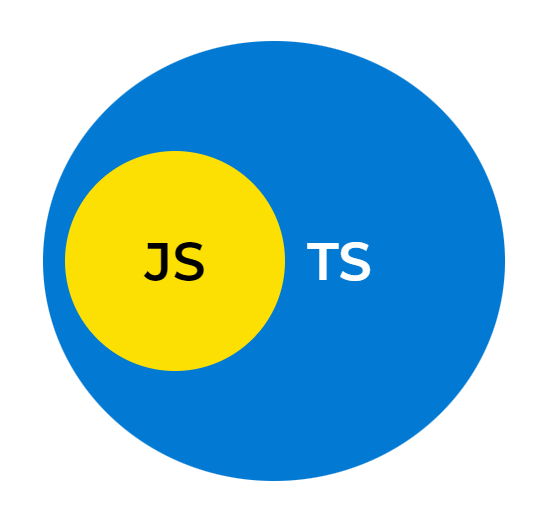

## 들어가며

자바스크립트는 `var`, `let`, `const`를 통해서 변수와 상수 및 함수까지도 선언할 수 있는데,
다음과 같은 문제를 경험해본 적이 있을 거라고 생각한다.

```javascript
function sum(a, b) {
  return a + b;
}

sum(input1, input2);
```

`input1`과 `input2`는 사용자의 입력을 통해 받는 변수라고 가정하면 다음과 같은 문제가 생길 수 있다.

```javascript
sum(10, "10"); // 1010
```

`sum` 함수를 설계할 때, Number 타입의 덧셈을 원했는데 문자열을 넣게 되어 원하지 않는 결과가 반환되고, 더 나아가 다른 기능에 영향을 줄 수 있다.
물론 위와 같은 경우에는 정규식을 사용해서 숫자만 받을 수 있도록 할 수 있다. 
하지만 우리는 프로그램을 만들면서 다양한 문제들을 맞이하게 된다. 

특히 Object 내부의 선언되지 않은 프로퍼티를 참조할 경우 `undefined`를 반환하는데, 이후 과정들에서 예상하지 못 한 오류가 발생할 수도 있다.
다음과 같이 BMI를 계산하는 함수가 존재한다고 가정해보자.

```javascript
const obj = {};

obj.weight // undefined
obj.height // undefined

function calcBMI(user) {
  return user.weight / Math.pow(user.height / 100, 2)
}

calcBMI(obj); // NaN
```

`calcBMI` 함수에 비어있는 객체를 인자를 넘기면 연산 자체에는 오류가 발생하지 않지만 결과값이 `NaN`이 나오게 된다.
이런 문제들이 자주 발생하지는 않겠지만 휴먼 에러가 발생할 가능성을 여전히 배제할 수는 없다.

즉 함수를 착각해서 배열을 인자로 받는 함수에 객체를 넘길 수도 있고, 객체를 인자로 받는 함수에 배열을 넘기는 상황이 발생할 수도 있다.
위와 같이 자바스크립트가 가지고 있는 문제들을 보완하고자 타입스크립트가 나오게 된다.

## 타입스크립트란?

타입스크립트는 자바스크립트의 상위 집합으로 ECMA 최신 표준을 지원한다.
새로운 언어라고 볼 필요 없으며, 자바스크립트를 이해하고 있다면 쉽게 사용할 수 있다.



이제 타입스크립트가 어떠한 특징을 가지는지에 대해 알아보자.

### 1. 정적 타입 언어

다음과 같이 타입을 정적으로 직접 명시할 수 있다.

```typescript
let username: string = "홍길동";
let age: number = 20;
let isGender: boolean = false;
```

배열과 객체에서도 명시할 수 있으며, 함수의 반환 값도 타입을 명시할 수 있다.

```typescript
const users: string[] = [];

function sum(a: number, b: number): number {
  return a + b;
}
```

타입을 명시하지 않은 경우에는 타입스크립트가 직접 타입을 추론한다.
기존 자바스크립트 코드와 동일하게 작성하더라도 문제가 되지 않으며, 정상적으로 작동한다.

```typescript
let username = "홍길동" // string
let age = 20; // number
let isGender = false; // boolean
```

### 2. 트랜스파일링

TSC (Typescript Compiler)는 타입스크립트로 작성된 파일을 자바스크립트로 트랜스파일링한다.
이 때 트랜스파일링 과정에서 코드의 타입을 확인하는데, 예를 들어 `1 + [2]`와 같은 코드가 있을 경우 오류를 알려준다.

```typescript
function sum(a: number, b: number): number {
  return a + b;
}

sum(5, "7");
```

숫자를 인자로 받는 `sum`이라는 함수에 문자열을 넘길 경우, 코드 에디터(Visual Studio Code)에서 밑줄을 통해 알려준다.
무시하고 TSC를 통해 트랜스파일링 작업을 진행한 경우, 다음과 같은 오류를 보여준다.

```typescript
error TS2345: 
Argument of type 'string' is not assignable 
to parameter of type 'number'.
```

### 3. 객체 지향 프로그래밍 지원

자바스크립트의 객체 지향과는 크게 다르지 않지만 인터페이스, 캡슐화처럼 추가적으로 지원하는 기능들이 존재한다.

#### 캡슐화 

클래스 내부에서 접근 제한자 public, protected, private 키워드를 사용할 수 있다.
접근 제한자를 따로 명시하지 않은 경우에는 public 키워드를 사용한 것과 동일하다.

```typescript
class Person {
  protected name: string;
  private age: number;

  constructor(name: string, age: number) {
    this.name = name;
    this.age = age;
  }
}

const p1 = new Person("홍길동", 20);
console.log(p1.name); // 접근 불가
console.log(p1.age); // 접근 불가
```

#### 추상화

인터페이스는 형태를 정의하는데 사용하며 클래스, 변수, 함수 모두 구현이 가능하다.
인터페이스는 클래스와 유사하게 프로퍼티와 메소드 모두 가지고 있을 수 있지만 직접 인스턴스를 생성할 수는 없다.
모든 메소드는 형태만 있는 추상 메소드라고 보면 된다.

다음과 같이 인터페이스를 사용하여 클래스가 구현할 함수와 변수를 정의할 수 있다.

```typescript
interface Animal {
  eat(): void;
  sleep(): void;
}

interface Bird {
  fly(): void;
}
```

#### 추상 클래스

추상 클래스는 추상 메소드를 비롯하여 일반 메소드를 가질 수 있는데, 추상 메소드와 추상 클래스는 모두 선언할 때 `abstract` 키워드를 사용해야 한다.
이렇게 만들어진 추상 클래스는 직접 인스턴스를 생성할 수 없지만 클래스에서 상속이 가능하다.
여기서 주의할 점은 추상 클래스를 상속한 클래스는 추상 메소드를 반드시 구현해야 한다.

```typescript
abstract class Animal {
  eat(): void {
    console.log("eat");
  }

  abstract run(): void;
}

class Cat extends Animal {
  run(): void {
    console.log("run");
  }
}
```

### 4. 자바스크립트 슈퍼셋(Superset)

결론적으로 타입스크립트는 자바스크립트 기본 문법에 타입스크립트의 문법을 추가한 언어라고 볼 수 있다.
실제로 자바스크립트 코드를 .ts 확장자로 변경하더라도 문제 없는 걸 알 수 있다.

## 타입스크립트 설치

```
npm install -g typescript
```