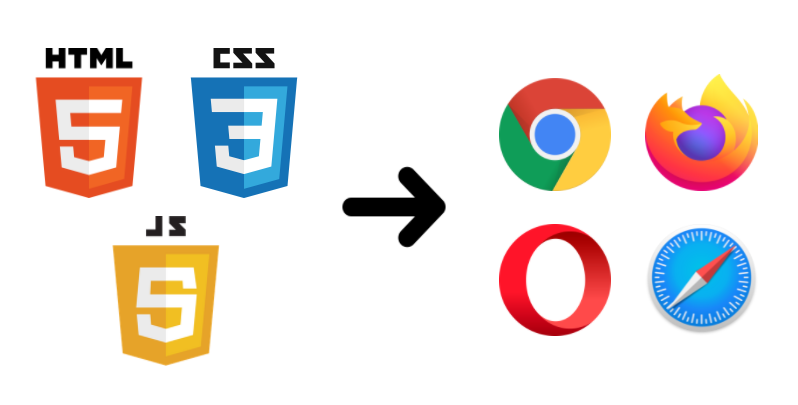
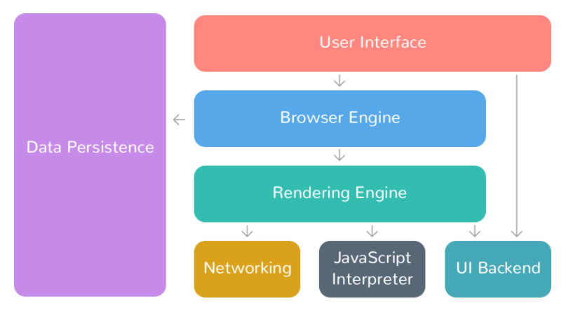
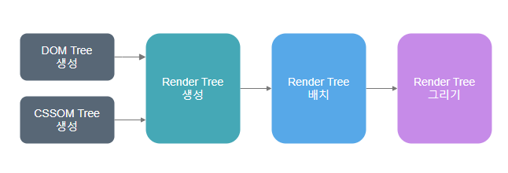
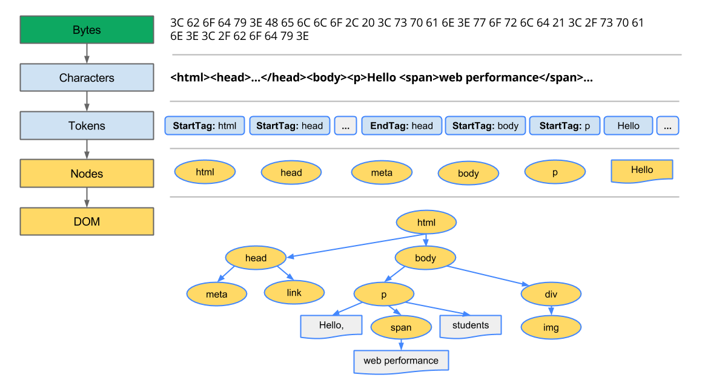
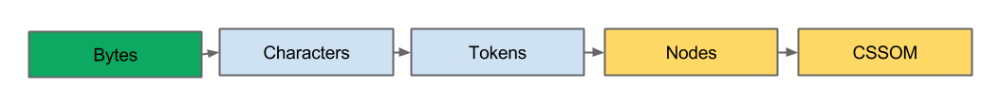
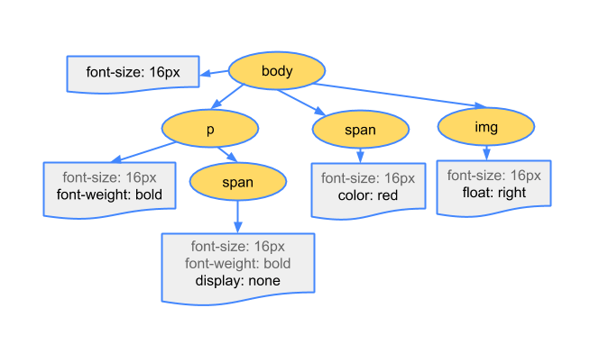
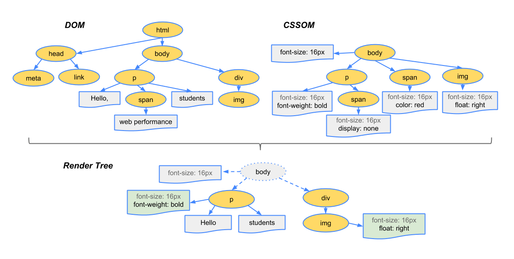

## 들어가며

우리는 브라우저를 통해 웹 사이트를 접속해서 네이버 쇼핑과 넷플릭스 시청등의 다양한 것들을 경험할 수 있다.
이렇게 다양한 웹 사이트를 사용할 수 있도록 하기 위해서는 개발된 HTML, CSS, JS 등의 파일이 필요하다.



그럼 브라우저는 어떻게 HTML, CSS, JS 등의 파일을 불러오고 화면에 보여지도록 하는 걸까?
브라우저 렌더링 방식 원리에 대해 알아보자.

## 브라우저 구조

웹 페이지를 보여주기 위해서는 브라우저가 많은 작업들을 한다.
브라우저는 크게 7가지로 구분되며, 다음과 같다.


(출처: https://medium.com/@pdster/how-web-browsers-work-6385b9374375)

#### 1. 사용자 인터페이스 (User Interface)

사용자가 접근할 수 있는 영역으로 웹 페이지를 제외한 모든 부분을 가리킨다.
주소 표시줄, 이전/다음/새로고침 버튼, 북마크 메뉴 등이 해당된다.

#### 2. 렌더링 엔진 (Rendering Engine)

HTML과 CSS를 파싱하여 요청한 웹 페이지를 표시한다.

#### 3. 브라우저 엔진 (Browser Engine)

사용자 인터페이스와 렌더링 엔진을 연결한다.

#### 4. 통신 (NetWorking)

HTTP 요청과 같은 각종 네트워크 요청들을 수행한다.

#### 5. UI 백엔드 (UI Backend)

`select`, `input`등 기본적인 위젯을 그리는 역할을 한다.

#### 6. 자료 저장소 (Data Persistence)

Cookie, Local Storage, Indexed DB등과 같이 보조 기억장치에 데이터를 저장한다.

#### 7. 자바스크립트 해석기 (Javascript Interpreter)

자바스크립트 코드를 해석하고 실행한다.

## 렌더링 과정

렌더링 엔진의 동작 과정은 다음과 같다.



### 1. DOM 트리 생성

HTML 코드는 다음과 같이 DOM 트리로 변환된다.



1. 변환: 브라우저가 HTML의 원시 바이트를 디스크 혹은 네트워크에서 읽어온다. 이후 해당 파일의 인코딩 설정 값에 따라 개별 문자로 변환한다.
2. 토큰화: 브라우저가 문자열을 HTML 토큰으로 변환한다.
3. 렉싱: 각 토큰들을 분석하여 해당 속성 및 규칙을 정의하는 객체로 변환한다.
4. DOM 생성: ul, li와 같은 태그들의 관계를 해석해서 트리 구조로 연결 된다.

브라우저는 HTML을 처리할 때마다 위와 같은 작업을 수행한다.

### 2. CSSOM 트리 생성

브라우저가 DOM 트리를 생성하는 과정에서 링크된 CSS 파일들을 만나게 된다.
브라우저가 CSS 파일들을 이해할 수 있도록 CSSOM 트리를 생성하는 과정을 가진다.

다음과 같이 CSSOM 트리는 DOM 트리와 동일한 과정으로 생성된다.



이렇게 생성된 CSSOM Tree의 구조는 다음과 같다.



### 3. 렌더링 트리 생성

DOM 트리와 CSSOM 트리가 생성되면 결합하여 렌더링 트리가 생성된다.
렌더링 트리에는 페이지를 렌더링하기 위해 필요한 노드만 포함하며, 화면에 레이아웃을 표현하기 위해 사용된다.



스크립트 태그, 메타 태그, display: none 속성을 가진 태그들의 경우에는 렌더링 트리에서 제외된다.
자바스크립트가 DOM이나 CSSOM을 변경할 경우, 변경된 DOM과 CSSOM으로 다시 결합하여 렌더링 트리가 생성된다.

### 4. 렌더링 트리 배치 (레이아웃)

레이아웃 단계에서는 결합된 렌더링 트리를 기반으로 viewport 내에서 요소들의 위치와 크기를 계산하는 작업을 한다.

모든 요소들은 "display" 속성을 가지게 되며, 속성의 값인 inline, block, flex등에 따라 어떻게 배치될지 결정된다.
실제 요소가 배치되는 방법은 다음과 같은 방법들이 존재한다.

- display 속성 (inline, block, flex, ...)
- 크기 (width, height, padding, ...)
- 위치 (position, float)

여기서 신기한 점은 요소의 position 속성의 값이 absolute, fixed인 경우, DOM 트리에서 위치한 자리와는 다른 렌더 트리에 위치하게 된다.
그 외에는 일반적으로 요소들을 배치한 이후에 요소를 움직이는 방식으로 배치한다.

### 5. 렌더링 트리 그리기 (페인팅)

페인팅 단계에서는 레이아웃 단계에서 완료된 요소들을 화면에 그리는 작업을 한다.
여기서 %, em, vh와 같은 상대적인 값들은 기계의 viewport에 맞춰서 절대적인 픽셀 값으로 변환된다.

## UI 업데이트

이렇게 완성된 웹 페이지는 사용자가 사용할 수 있도록 보여지게 되며, 다양한 작업들을 할 수 있다.
사용자의 팝업 오픈, 스크롤 등과 같은 이벤트로 인해서 보이지 않던 요소가 보이게 되거나, 기존에 존재하지 않던 요소가 추가되는 등 변경이 발생할 수 있다.

변경을 통해 영향을 받는 모든 노드들은 렌더링 트리 생성부터 레이아웃 과정을 다시 수행해야 하는데, 이러한 과정을 리플로우라고 한다. 

물론 사용자가 화면에서 볼 수 있도록 하기 위해서는 페인팅 단계를 다시 수행해야 하는데, 이러한 과정을 리페인트라고 한다.

background-color, color 변경과 같이 요소의 위치나 크기에 영향이 없는 경우에는 리플로우 과정은 생략되며, 리페인트만 이루어진다.
다만 리플로우 과정이 발생하면 리페인트는 반드시 발생한다는 점을 알아야 한다.

### 리플로우는 언제 발생할까?

리플로우는 다음과 같은 변경이 있을 때 발생한다.
이외에도 다양한 상황이 존재하며, 거의 대부분의 경우에 리플로우가 발생한다고 보면 된다.

- 요소의 추가/수정/삭제
- 요소의 위치 변경
- 요소의 애니메이션
- 요소의 스타일 변경 
- 브라우저 크기 변경
- 스크롤

### 리페인트만 일어나는 경우?

background, color, border-style, border-radius와 같이 요소의 위치/크기에 영향을 주지 않는 변경을 할 때, 리페인트만 발생한다.

```javascript
elem.style.padding = "15px"; // 리플로우, 리페인트
elem.style.border = "3px solid #000"; // 리플로우, 리페인트
elem.style.backgroundColor = "#f5f5f5"; // 리페인트
elem.style.color = "#666"; // 리페인트

elem.appendChild(document.createElement("div")); // 리플로우, 리페인트
```

### 레이어 합성 (Composite)

레이아웃과 페인트 단계를 수행하지 않고, 레이어의 합성만 발생하는 단계로 성능상 가장 큰 이점을 가지게 된다.

물론 브라우저마다 이러한 단계들이 다르게 작동하긴 하지만 크롬(Blink)에서는 cursor, perspective등을 레이어 합성만 수행하는 속성으로 볼 수 있다.