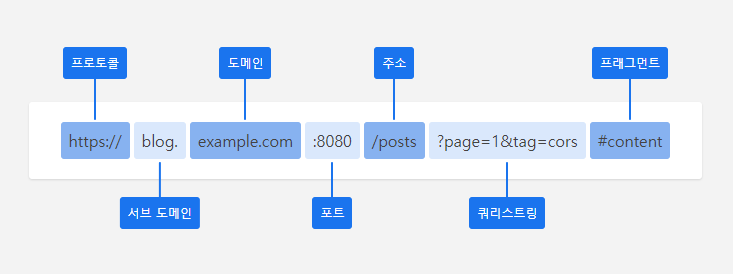

## 들어가며

React, Vue와 같은 라이브러리/프레임워크로 SPA 어플리케이션을 만들다 보면 서버로부터 데이터를 받아야 하는 상황이 생긴다.
데이터를 요청하기 위해서는 브라우저 자체적으로 지원하는 `XMLHttpRequest` 혹은 ES6 이후에 나온 `fetch`를 사용하거나 `axios`와 같은 라이브러리를 사용하기도 한다.

근데 가끔 데이터를 요청하다 보면 아래와 같은 에러가 발생하는 것을 볼 수 있다.

::: danger CORS 에러
Access to fetch at **'https://api-example.com/users'** from origin **'http://localhost'** has been blocked by CORS policy: No 'Access-Control-Allow-Origin' header is present on the requested resource. If an opaque response serves your needs, set the request's mode to 'no-cors' to fetch the resource with CORS disabled.
:::

CORS 정책을 위반할 때, 위와 같은 에러가 발생한다.
CORS가 무엇인지에 대해 알아보고, 어떻게 해결해야 하는지에 대해 알아보자.

## CORS가 필요한 이유

기본적으로 브라우저는 동일 출처 정책(Same-Origin Policy)에 따라 다른 출처의 리소스를 사용할 수 없고, 동일한 출처의 리소스만 사용이 가능하다.

하지만 실제로 개발을 하다 보면 API를 사용해야 하거나, 구글 웹 폰트의 사용이 필요한 상황이 생긴다.
특히 SPA로 구현된 어플리케이션에서는 API의 요청은 필수가 될 수 밖에 없다.

이렇게 다른 출처에 요청해야 하는 경우가 많아지고 있어서, 이러한 요청들을 안전하게 처리할 수 있는 방법이 필요했다.
덕분에 CORS가 등장하게 되었으며, CORS는 다른 출처의 요청을 선택적으로 허용함으로써 안전하게 처리할 수 있다.

## 동일 출처 정책 (Same-Origin Policy)

보안적인 이유로 브라우저가 동일한 출처의 리소스만 사용할 수 있도록 하는 정책이다.
다른 출처의 리소스를 가지고 오지 못 한다는 단점이 있으나, **XSS**, **XSRF**와 같은 공격을 방어할 수 있다.
하지만 다른 출처로 요청할 수 없게 되면 웹 어플리케이션은 한계를 맞이할 수 밖에 없게 된다.
즉 기본적으로는 브라우저는 동일 출처 정책을 따르지만 예외적으로 CORS를 통해, 다른 출처에 요청할 수 있게 된다.

## CORS (교차 출처 리소스 공유)

CORS는 Cross-origin Resource Sharing의 약자로, 교차 출처 리소스 공유라고 번역할 수 있다.
어플리케이션을 서비스하기 위해서는 구글/페이스북과 같은 로그인 연동 혹은 결제 서비스 이용을 할 때, 다른 출처로 요청이 필요할 때가 존재한다.
어플리케이션에서 다른 출처로 요청할 때 cross-origin HTTP 요청을 실행하는데, 보안적인 이유로 요청들을 제한한다.
이 때, 추가 HTTP 헤더를 사용하여, 다른 출처에 접근할 수 있도록 브라우저에 알리는 것을 CORS라고 한다.

주로 아래와 같은 요청들이 CORS를 사용한다.

- XMLHttpRequest 혹은 Fetch API 호출
- @font-face 사용
- Canvas - drawImage()

### URL 구조

다른 출처는 단순히 도메인이 다른 경우를 의미하는 걸까?
출처를 구분하기 위해서는 URL의 구조에 대한 이해가 필요하다.

URL 구조는 아래 이미지와 같다고 볼 수 있다.



모든 URL이 다음과 같은 구조는 아니지만 기본적으로 프로토콜, 도메인, 주소까지는 필수 요소라고 보면 된다.
그리고 프로토콜의 HTTP와 HTTPS는 각각 80과 443 포트를 사용하는데, 이는 생략 가능하다.

### 다른 출처 구분

먼저 출처(origin)에 대해서 알아야 하는데, 프로토콜과 도메인 그리고 포트를 합친 것을 출처라고 이야기한다.
다음과 같이 `location.origin` 명령어를 통해 출처를 확인할 수 있다.

```javascript
// 현재 주소 : https://blog.example.com:8080/posts?page=1&tag=cors#content
location.origin 
"https://blog.example.com:8080" // 출처
```

프토토콜, 도메인, 포트 어느 하나라도 다른 경우에는 다른 출처로 구분된다.
기준이 되는 현재 주소가 "https://blog.example.com:8080"이라고 가정할 때, 같은 출처와 다른 출처는 다음과 같다.

```javascript
"https://blog.example.com:8080/posts" // 같은 출처
"https://blog.example.com:8080/posts?page=1" // 같은 출처
"https://blog.example.com:3000" // 다른 출처
"https://api.example.com" // 다른 출처
"http://blog.example.com:8080" // 다른 출처
```

## CORS 요청 방법

브라우저 관점에서 봤을 때, CORS 요청은 두 가지 종류로 구분할 수 있다.

1. 안전한 요청 - 단순 요청 방법 
2. 안전하지 않은 요청 - 사전 요청 방법

### 단순 요청 (Simple Request)

단순 요청은 사전 요청 없이 서버에게 바로 요청을 보내는 방법이다.

예를 들어 "https://blog.example.com"에서 데이터를 받기 위해, "https://api.example.com/posts"로 요청을 보낸다고 가정하면 헤더는 다음의 형태를 가진다.

```
GET /posts
HOST: api.example.com
Origin: https://blog.example.com
...
```

서버는 요청 헤더에 있는 출처(Origin)를 확인하는데, `Access-Control-Allow-Origin`에 설정된 값이 `*` 혹은 요청한 출처 정보가 있는 경우에는 응답은 성공하고 그렇지 않은 경우 실패하게 된다.

단순 요청이 되기 위해서는 아래 조건들을 충족해야 한다.
(이외에도 추가 조건들이 존재한다.)

- 요청 메소드는 GET, HEAD, POST 중 하나여야 한다.
- 브라우저에서 자동으로 설정한 헤더 외에는 `Accept`, `Accept-Language`, `Content-Language`, `Content-Type` 이외의 헤더를 설정할 수 없다.
- Content-Type 헤더는 `application/x-www-form-urlencoded`, `multipart/form-data`, `text/plain` 중 하나를 사용해야 한다.

### 사전 요청 (Preflight Request)

REST API의 경우, GET과 POST 메소드 뿐만 아니라 PUT, DELETE, PATCH 등 다양한 메소드를 사용한다.
이렇게 허용하지 않는 메소드를 사용한 요청이 들어오면 서버에 바로 요청을 보내지 않고, 사전 요청을 보내고 권한이 있는지를 확인한다.

사전 요청은 `OPTIONS` 메소드를 통해, 안전한 요청인지를 확인한다.

- `Access-Control-Request-Method`: 안전하지 않은 요청에서 사용하는 메소드 정보
- `Access-Control-Request-Headers`: 안전하지 않은 요청에서 사용하는 헤더의 목록

서버에서 안전하지 않은 요청을 허용한 경우, 상태 코드 200과 아래 헤더들을 포함해 브라우저로 보낸다.

- `Access-Control-Allow-Origin`: 허용된 출처 정보
- `Access-Control-Allow-Methods`: 허용된 메소드 정보
- `Access-Control-Allow-Headers`: 허용된 헤더의 목록
- `Access-Control-Max-Age`: 권한 허용을 캐싱한 시간

사전 요청은 다음과 같은 단계로 진행 된다.

1. 사전 요청
2. 사전 요청에 대한 응답
3. 실제 요청
4. 실제 요청에 대한 응답

## HTTP 응답 헤더

XHR 혹은 Fetch API로 요청 시, 크롬 개발자도구 Network 탭에서 다음과 같은 화면을 본 적이 있을텐데, 응답 헤더(Response Headers)에 대해 알아보자.

```
Response Headers
  Access-Control-Allow-Credentials: false
  Access-Control-Allow-Headers: *
  Access-Control-Allow-Methods: GET
  Access-Control-Allow-Origin: *
  Access-Control-Max-Age: 86400
  content-length: 5856
  content-type: application/json
  date: Mon, 31 Jan 2022 08:24:32 GMT
  server: AmazonS3
```

### Access-Control-Allow-Origin

허용하고자 하는 출처를 지정하여, 해당 출처가 리소스에 접근할 수 있도록 허용한다.

```
Access-Control-Allow-Origin: https://blog.example.com
```

다음과 같이 `*`로 설정한 경우, 출처에 관계없이 모든 리소스에 접근하도록 허용한다.

```
Access-Control-Allow-Origin: *
```

### Access-Control-Allow-Methods

리소스에 접근할 때 허용하는 메소드를 지정한다.
다음과 같이 GET, POST, PUT, DELETE 등의 HTTP 메소드를 지정하면 된다.

```
Access-Control-Allow-Methods: GET, POST
```

### Access-Control-Allow-Headers

사용할 수 있는 헤더를 지정한다.

```
Access-Control-Allow-Methods: Content-Type, Authorization
```

### Access-Control-Max-Age

preflight 요청 결과를 캐시할 수 있는 시간을 지정한다.

```
Access-Control-Max-Age: 3600 // 1시간
```

### Access-Control-Expose-Headers

브라우저에서 접근할 수 있는 헤더를 지정한다.

```
Access-Control-Expose-Headers: X-My-Custom-Header, X-Another-Custom-Header
```

### Access-Control-Allow-Credentials

요청한 `credentials` 값이 true일 경우, 응답을 표시할 건지에 대해 지정한다.

```
Access-Control-Allow-Credentials: true
```

출처가 다른 경우, request header에 쿠키가 자동으로 들어가지 않기 때문에, 쿠키를 넣기 위해서는 작업이 필요하다.
서버의 응답 헤더에서는 허용되어야 하며, 요청 시에도 다음과 같은 작업이 필요하다.

```javascript
// XHR 사용
const req = new XMLHttpRequest();
req.open('GET', 'http://blog.example.com');
req.withCredentials = true;
req.send();

// Fetch API 사용
fetch('http://blog.example.com', {
  credentials: "include"
});
```